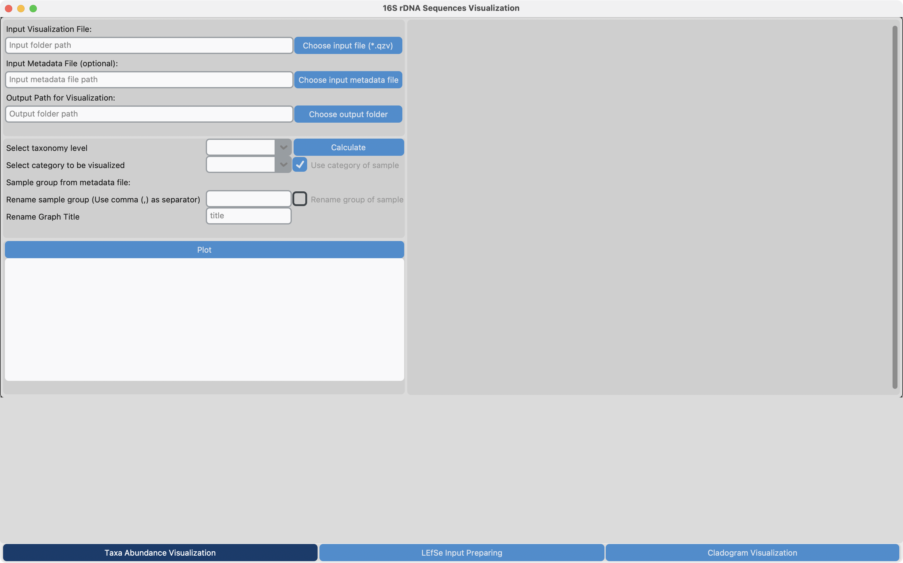
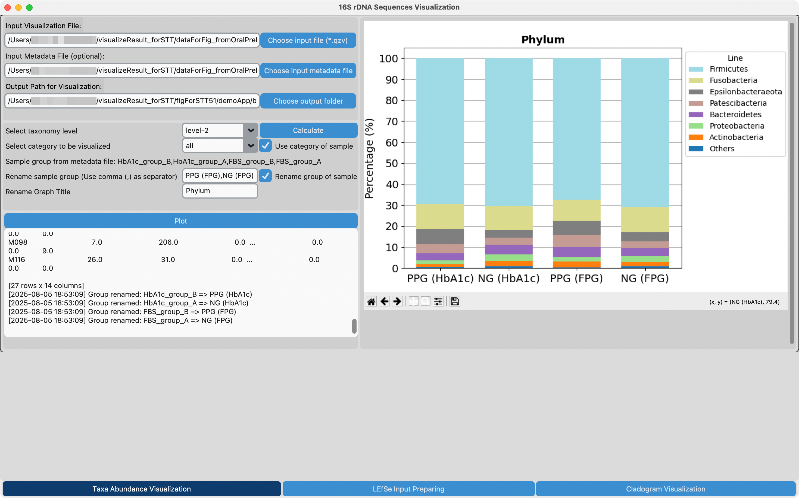
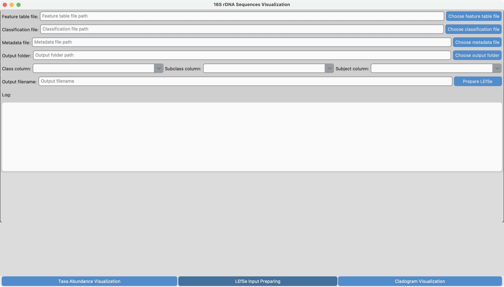

# Viz16S-Ampli

<!--  -->
<!--  -->
<!--  -->

> A software for visualize the result from 16S rDNA amplicon sequencing analysis.

---

## Table of Contents
- [Viz16S-Ampli](#viz16s-ampli)
	- [Table of Contents](#table-of-contents)
	- [About](#about)
	- [Features](#features)
	- [Tech Stack](#tech-stack)
	- [Requirements](#requirements)
	- [Installation](#installation)
	- [Usage](#usage)
		- [Taxonomic Structure Visualization](#taxonomic-structure-visualization)
			- [1. Open application `Viz16S-Ampli`](#1-open-application-viz16s-ampli)
			- [2. Provide inputs for Taxonomic Structure Visualization:](#2-provide-inputs-for-taxonomic-structure-visualization)
			- [3. Press `Calculate` button](#3-press-calculate-button)
			- [4. Press `Plot` button](#4-press-plot-button)
			- [5. (Optional) Adjust plot position and size](#5-optional-adjust-plot-position-and-size)
			- [6. Press save button under the plot to save the figure](#6-press-save-button-under-the-plot-to-save-the-figure)
		- [LEfSe Input Preparation](#lefse-input-preparation)
			- [1. Select `LEfSe Input Preparing` tab](#1-select-lefse-input-preparing-tab)
			- [2. Provide inputs for LEfSe Preparation:](#2-provide-inputs-for-lefse-preparation)
			- [3. Press `Prepare LEfSe` button](#3-press-prepare-lefse-button)
	- [License](#license)
	- [Contact](#contact)

---

## About
The Viz16S Ampli is a software that aimed to simplify the visualization of a result from 16S rDNA amplicon sequencing. The visualization in this application including a taxonomic structure (taxa abundance) bar plot and a cladogram with biomarkers from linear discriminant analysis effect size (LEfSe). Viz16S-Ampli is developed based on analysis result from QIIME2 amplicon version 2024.5.

This application can be used on without the internet access after the first installation of the dependency applications.

Viz16S-Ampli requires command line interface applications installed locally to be performed the visualization. 

The instruction for installation and application usage can be found below.

---

## Features
- ✅ Visualize taxonomic structure bar plot of 16S rDNA amplicon sequencing analysis result from ***barplot*** function in **QIIME2 taxa** plugin.
- ✅ Input preparation for LEfSe analysis from three inputs i.e., metadata, feature name (taxonomical name), and classification.
- ✅ Visualize cladogram plot with biomarker determine from LEfSe analysis

---

## Tech Stack
- **Language:** Python
- **GUI Development:** Customtkinter, Tkinter, Matplotlib
- **Backend** Pandas, Dokdo, LEfSe, Export2graphlan, GraPhlAn
- **CI/CD:** GitHub Actions

---

## Requirements
**MacOS** with **Apple Silicon** processor.

---

## Installation
- Download this repository as `.zip` file
- Open file `viz16S_Ampli-Install.command`

---

## Usage

### Taxonomic Structure Visualization

#### 1. Open application `Viz16S-Ampli`

#### 2. Provide inputs for Taxonomic Structure Visualization:

- Select input file by pressing `Choose input file (*.qzv)` button
  - An output from **QIIME2 taxa** ***barplot*** formatted as `*.qzv`
- Select output folder (Must be empty folder) by pressing `Choose output folder` button.
  - The input `*.qzv` will be extracted and shown in dropdown menu right after selection.
- Select taxonomic level to be visualized from dropdown menu `Select taxonomic level`
- Choose category to be visualized from dropdown menu `Select category to be visualized`
- (optional) Check `Rename group of sample` to edit the x-axis label
  - Specify the name for each category to be labeled on x-axis (the label for each category separate by comma (`,`) only)
- (optional) Specify title for the visualization plot

#### 3. Press `Calculate` button

#### 4. Press `Plot` button

#### 5. (Optional) Adjust plot position and size

#### 6. Press save button under the plot to save the figure

---

### LEfSe Input Preparation

#### 1. Select `LEfSe Input Preparing` tab

#### 2. Provide inputs for LEfSe Preparation:

- Select feature table file by pressing `Choose feature table file (*.qza)` button
  - An output from **QIIME2 dada2** ***denoise*** formatted as `*.qza`
- Select classification file by pressing `Choose classification file (*.qza)` button
  - An output from **QIIME2 feature-classifier** ***classify-sklearn*** formatted as `*.qza`
- Select metadata file of the sequences by pressing `Choose metadata file (*.tsv)`
- Select output folder (Must be empty folder) by pressing `Choose output folder` button.
  - The classification with feature name and metadata will be constructed in single file in `*.tsv` format to be used as an input for Cladogram visualization
- Specify column from metadata file to be used as `class`, `subclass`, and `subject` in dropdown menu
- (optional) Specify an outputfile name

#### 3. Press `Prepare LEfSe` button

---

<!-- ## Roadmap
- [ ] Add authentication
- [ ] Implement dark mode
- [ ] Add mobile support

---

## Contributing
1. Fork the repo
2. Create a branch
3. Submit a pull request

--- -->

## License

This project is licensed under the MIT License.

---

## Contact
- Email: phurinat.udo@outlook.com
- GitHub: [phurinat-udo](https://github.com/phurinat-udo)
- LinkedIn: [Phurinat Udomsopagit](http://linkedin.com/in/phurinat-udomsopagit)
